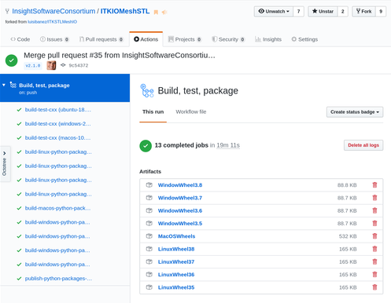
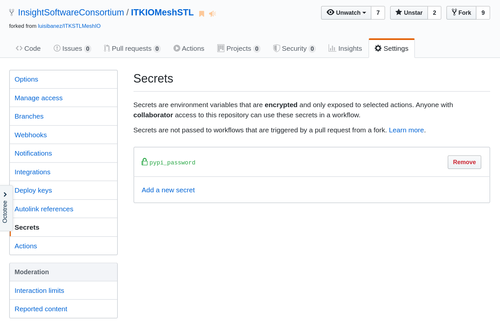
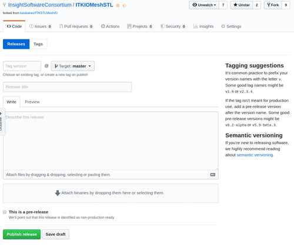

=====================================
Build ITK Module Python packages
======================================

ITK is organized into *modules*. Modules for ITK can be developed outside the
ITK source tree as *remote modules*. The *remote module* can be made
available in ITK's `CMake <https://www.cmake.org>`_ configuration by
`contributing it
<https://github.com/InsightSoftwareConsortium/ITKModuleTemplate#remote-module>`_
as a *remote module*. Python packages can also be generated for remote
modules and uploaded to the `Python Package Index (PyPI) <https://pypi.org>`_

This section describes how to create, build, and upload ITK remote
module Python packages to PyPI.

.. include:: Prerequisites.rst

Create the module
=================

To create an ITK module with Python wrapping, first run cookiecutter::

  python -m pip install cookiecutter
  python -m cookiecutter gh:InsightSoftwareConsortium/ITKModuleTemplate
  # Fill in the information requested at the prompts

Then, add your classes. Reference documentation on `how to populate the module
<https://itk.org/ITKSoftwareGuide/html/Book1/ITKSoftwareGuide-Book1ch9.html#x50-1430009>`_
can be found in the `ITK Software Guide
<https://itk.org/ITKSoftwareGuide/html/>`_.

GitHub automated CI package builds
==================================

Freely available GitHub Action continous integration (CI) build and test
services for open source repositories are provided by
`GitHub <https://github.com/>`_. These services will build and test the C++
code for your module and also generate Linux, macOS, and Windows Python
packages for your module.

For every pull request and push to the GitHub repository, a GitHub Action will
run that builds and runs the repository's C++ tests and reports the results to
the `ITK CDash Dashboard <https://open.cdash.org/index.php?project=Insight>`_.
Python packages are also generated for every commit. Packages for a commit's
build can be downloaded from the GitHub Action result page in the *Artifacts*
Section.

Upload the packages to PyPI
----------------------------

First, `register for an account on PyPI <https://pypi.org>`_.

Next, create a `~/.pypirc` file with your login credentials::

  [distutils]
  index-servers =
    pypi
    pypitest

  [pypi]
  username=<your-username>
  password=<your-password>

  [pypitest]
  repository=https://test.pypi.org/legacy/
  username=<your-username>
  password=<your-password>

where `<your-username>` and `<your-password>` correspond to your PyPI account.

Then, upload wheels to the testing server. The wheels of dist/* are those that
you have built locally or have downloaded from a recent build listed at
`https://github.com/InsightSoftwareConsortium/<your-long-module-name>/actions`.
::

  python -m pip install twine
  python -m twine upload -r pypitest dist/*

Check out the packages on `<https://test.pypi.org/>`_ the testing server.

Finally, upload the wheel packages to the production PyPI server::

  python -m twine upload dist/*

Congratulations! Your packages can be installed with the commands::

  python -m pip install --upgrade pip
  python -m pip install itk-<your-short-module-name>

where `itk-<your-short-module-name>` is the short name for your module that is
specified in your setup.py file.

Automate PyPI Package Uploads
-----------------------------

Automated uploads of Python packages to the Python package index, `PyPI
<https://pypi.org>`_ will occur after adding a PyPI upload token to GitHub and
creating a Git tag. Create a PyPI API token by logging in to
`<https://pypi.org/manage/account/token/>`_. Generally, for the token name
use::

  itk-<your-short-module-name>-github-action

and for the scope use::

  itk-<your-short-module-name>

where `<your-short-module-name>` is the short name for your module that is
specified in your setup.py file. That scope will be available if you have
already uploaded a first set of wheels via twine as described above; and that
is the recommended approach. Otherwise, if you are creating the project at
this time, choose an unlimited scope, but be careful with the created token.

.. figure:: images/PyPIToken.png
  :alt: PyPI Token

Then, add the API token to the GitHub repository
`https://github.com/InsightSoftwareConsortium/<your-long-module-name>`. Choose
the *Settings -> Secrets* page and add a key called *pypi_password*, setting
the password to be the token string that begins with `pypi-`. Note that this
will be a *token* instead of a password. Limit the scope of the token to the
individual package as a best practice.

To push packages to PyPI, first, make sure to update the `version` for your
package in the *setup.py* file. The initial version might be `0.1.0` or
`1.0.0`. Subsequent versions should follow
`semantic versioning <https://semver.org/>`_.

Then, create a Git tag corresponding to the version. A Git tag can be created
in the GitHub user interface via *Releases -> Draft a new release*.

Automated platform scripts
==========================

Automated scripts are available in this repository to build Python packages
that are binary compatible with the Python distributions provided by
Python.org, Anaconda, and package managers like apt or Homebrew.
The following sections outline how to use the associated scripts for Linux,
macOS, and Windows.

Once the builds are complete, Python packages will be available in the `dist`
directory.

Linux
-----

To build portable Python packages on Linux, first `install Docker
<https://docs.docker.com/engine/installation/>`_.

For the first local build, clone the `ITKPythonPackage` repository inside your
and download the required ITK binary builds::

  cd ~/ITKMyModule
  git clone https://github.com/InsightSoftwareConsortium/ITKPythonPackage
  ./ITKPythonPackage/scripts/dockcross-manylinux-download-cache-and-build-module-wheels.sh

For subsequent builds, just call the build script::

  ./ITKPythonPackage/scripts/dockcross-manylinux-build-module-wheels.sh

macOS
-----

First, install the Python.org macOS Python distributions. This step requires sudo::

  cd ~/ITKMyModule
  git clone https://github.com/InsightSoftwareConsortium/ITKPythonPackage
  ./ITKPythonPackage/scripts/macpython-install-python.sh

Then, build the wheels::

  ./ITKPythonPackage/scripts/macpython-build-wheels.sh

Windows
-------

First, install Microsoft Visual Studio 2015, Git, and CMake, which should be added to the system PATH environmental variable.

Open a PowerShell terminal as Administrator, and install Python::

	PS C:\> Set-ExecutionPolicy Unrestricted
	PS C:\> $pythonArch = "64"
	PS C:\> iex ((new-object net.webclient).DownloadString('https://raw.githubusercontent.com/scikit-build/scikit-ci-addons/master/windows/install-python.ps1'))

In a PowerShell prompt, run the `windows-build-wheels.ps1` script::

	PS C:\Windows> cd C:\ITKMyModule
	PS C:\ITKMyModule> git clone https://github.com/InsightSoftwareConsortium/ITKPythonPackage.git IPP
	PS C:\ITKMyModule> .\ITKPythonPackage\scripts\windows-download-cache-and-build-module-wheels.ps1
